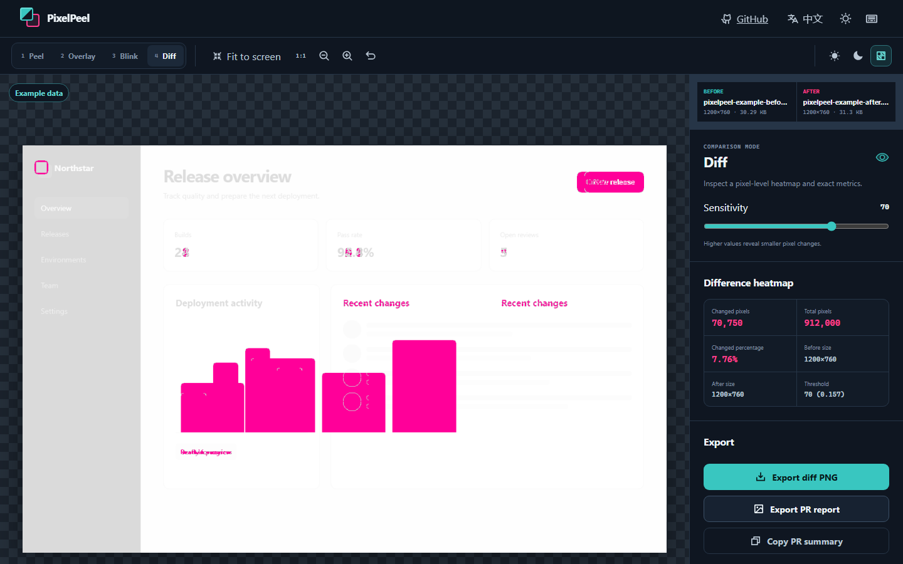

# PixelPeel

> Peel back UI changes, pixel by pixel.

[](https://github.com/KanadeK/pixelpeel/actions/workflows/ci.yml)
[](https://github.com/KanadeK/pixelpeel/actions/workflows/pages.yml)
[](LICENSE)
[](https://www.typescriptlang.org/)

[English](README.md) · [简体中文](README.zh-CN.md)

A local-first visual diff tool for comparing UI screenshots and exporting PR-ready reports. Drop in a before and after image, inspect the change in four focused views, and export the result without uploading either image.

**Live demo: [https://kanadek.github.io/pixelpeel/](https://kanadek.github.io/pixelpeel/)**



## Features

- Import PNG, JPEG, or WebP images by file picker, drag and drop, or clipboard paste. PixelPeel decodes each file in the browser, rejects invalid images and images larger than 40 megapixels, and shows the file name, decoded dimensions, and size with replace and clear actions.
- Compare equal-size images directly. When dimensions differ, PixelPeel normalizes both images onto the larger transparent RGBA canvas, with centered or top-left alignment.
- Inspect changes with four modes:
  - **Peel** — drag a mouse-, touch-, or keyboard-accessible divider between Before and After.
  - **Overlay** — adjust the After layer from 0% to 100% opacity.
  - **Blink** — alternate the images at 250, 500, or 1,000 ms, with pause controls, background-tab pausing, and reduced-motion awareness.
  - **Diff** — generate a real pixel-difference heatmap and view changed pixels, total pixels, percentage, dimensions, and threshold.
- Fit, view at 100%, zoom, and pan without changing source pixels or diff calculations. Preview against light, dark, or checkerboard backgrounds.
- Export a full-resolution diff PNG or a composed PR report PNG, and copy a Markdown summary for a pull request or issue.
- Switch between English and Simplified Chinese, light and dark themes, and desktop or narrow layouts.
- Load a bundled example to explore every comparison mode without supplying your own files.

## Privacy

**Images never leave your browser.** PixelPeel decodes, normalizes, compares, and exports images with browser APIs on your device. It has no backend, account system, analytics, telemetry, remote logging, or image-upload endpoint.

Image bytes are not written to `localStorage`, IndexedDB, cookies, or other persistent browser storage. Refreshing the page clears imported images. The language preference may be stored locally; it contains no image data. Exporting a file and copying a PR summary happen only after you request those actions.

The checkerboard, light, and dark canvas options are preview backgrounds only. They are not added to exported images and do not participate in pixel comparison.

As with any local application, your browser, operating system, extensions, and the files you choose remain part of your security boundary. See [SECURITY.md](SECURITY.md) for responsible disclosure.

## Quick start

Prerequisites: [Node.js](https://nodejs.org/) 24 and npm. If you use `nvm`, the repository includes an `.nvmrc` file.

```bash
nvm use
npm ci
npm run dev
```

Open the local URL printed by Vite. No backend or environment variables are required.

## Build

```bash
npm run build
npm run preview
```

The production site is emitted to `dist/`. Vite is configured for the `/pixelpeel/` base path used by GitHub Pages.

## Test

```bash
npm run lint
npm run format:check
npm run typecheck
npm run test
npm run build
npx playwright install chromium
npm run test:e2e
```

Vitest covers image normalization, RGBA diff behavior, validation, formatting, exports, and translations. Playwright covers the primary import, comparison, language, theme, copy, export, and responsive workflows.

## Project structure

```text
pixelpeel/
├── src/                 React UI, translations, image processing, and exports
├── public/              Bundled static assets and local example images
├── tests/               Deterministic fixtures shared by automated tests
├── e2e/                 Playwright end-to-end tests
├── docs/screenshot.png  README screenshot from the real application
├── .github/             CI, Pages deployment, templates, and Dependabot
└── vite.config.ts       Vite and GitHub Pages base-path configuration
```

Some test files may be colocated with the source they exercise.

## Keyboard shortcuts

Shortcuts are ignored while a text or range input has focus.

| Key      | Action                                      |
| -------- | ------------------------------------------- |
| `1`      | Peel mode                                   |
| `2`      | Overlay mode                                |
| `3`      | Blink mode                                  |
| `4`      | Diff mode                                   |
| `F`      | Fit to screen                               |
| `0`      | View at 100%                                |
| `Space`  | Pause or resume Blink                       |
| `R`      | Reset the view                              |
| `Escape` | Close a non-essential overlay or help panel |

## Browser support

PixelPeel targets the latest stable releases of Chrome, Edge, Firefox, and Safari. Image decoding, Canvas 2D, object URLs, file downloads, and clipboard access must be available. Clipboard behavior can depend on browser permission and secure-context rules; file import remains available when clipboard access is unavailable.

## Roadmap

Version 0.1.0 intentionally focuses on a dependable single-pair browser workflow. Possible future directions include batch comparison, a CLI or CI visual-regression workflow, URL capture, video or GIF comparison, Figma integration, a browser extension, and collaboration. These are ideas, not committed features or timelines; none are exposed as inactive controls in the current app.

PixelPeel does not require accounts, cloud sync, AI analysis, or server-side image processing.

## Contributing

Bug reports, accessibility improvements, tests, documentation, and focused code changes are welcome. Read [CONTRIBUTING.md](CONTRIBUTING.md) and the [Code of Conduct](CODE_OF_CONDUCT.md) before opening a pull request.

For vulnerabilities, follow [SECURITY.md](SECURITY.md) instead of posting sensitive details in a public issue.

## License

Copyright © 2026 KanadeK. PixelPeel is released under the [MIT License](LICENSE).
